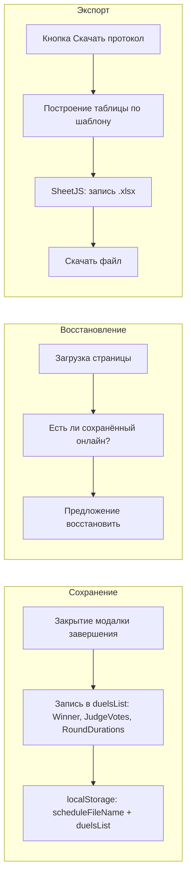

# Автоматический протокол онлайна

## Цель

- После проведения онлайна получать файл протокола в формате, как во вложении (столбцы «Поединок 1», «Поединок 2»…; строки: Игрок 1, Игрок 2, Победитель, Судья 1…N, Длительность Раунд 1–3). Количество строк судей **N берётся из duelsList** — максимум по полю `RefereeQty` (9, 7 или 5) среди всех поединков.
- Имя файла: из имени загруженного xlsx, например `Онлайн я-ИТ-ы №25.xlsx` → **Протокол Онлайн я-ИТ-ы №25.xlsx**.
- Файл генерируется в браузере и **скачивается** (без бэкенда на сервер не загружается).
- Данные не теряются при обновлении страницы: состояние онлайна (результаты поединков) сохраняется в **localStorage** и по запросу восстанавливается.

## Текущее состояние

- В [js/timer-code.js](js/timer-code.js): загрузка расписания из xlsx (SheetJS), `duelsList`, `currentDuel`, имена игроков из полей/из дуэля, количество судей `refereeQty` (9/7/5), голоса в `refereeList[i].vote` (0/1/2), счёт считается в `calcAndShowScore()`.
- При «Завершить поединок» открывается модалка судей, по «Завершить поединок» в модалке вызывается `finishDuelAndClose()` — модалка закрывается, но **результаты в `duelsList` не записываются**, длительности раундов и победитель нигде не хранятся.
- Имя загруженного файла показывается в `#file-name` (без расширения) в `processDuelsJson(file)`, но в переменной для протокола **не сохраняется**.
- Длительности раундов в коде не считаются (есть только `current_round` и таймеры `time[1]`, `time[2]`).

## Архитектура

## Шаги реализации

### 1. Сохранять имя файла расписания

- Ввести глобальную переменную `scheduleFileName` (строка без расширения).
- В `processDuelsJson(file)` после установки `fileName.innerHTML` записывать:  
`scheduleFileName = file.name.replace(/\.(xlsx|json)$/i, '');`
- При отсутствии загруженного файла использовать для имени протокола fallback, например `"Протокол онлайна"`.

### 2. Считать и сохранять длительности раундов

- Добавить переменные: `roundStartTime` (Date.now() при старте раунда), `roundDurations` (массив секунд).
- В `start_duel()`: `roundStartTime = Date.now()`, `roundDurations = []`.
- В `change_player()` (смена раунда):  
`roundDurations.push(Math.floor((Date.now() - roundStartTime) / 1000))`, затем `roundStartTime = Date.now()`.
- В `stop_duel()` перед открытием модалки судей: добавить длительность текущего раунда в `roundDurations` (аналогично).

Формат в протоколе: минуты:секунды (например `2:23`) — при экспорте переводить секунды в `M:SS` или `MM:SS`.

### 3. При закрытии модалки «Завершить поединок» писать результат в duelsList

- В `finishDuelAndClose()` (или по событию `hidden.bs.modal` у модалки) перед закрытием:
  - Определить победителя по счёту (кто больше голосов; при равенстве — пустая строка или «Ничья» по желанию).
  - Записать в `duelsList[currentDuel]`:
    - `Winner` — имя победителя (или пусто).
    - `JudgeVotes` — массив голосов только видимых судей по порядку (значения 1 или 2; не голосовал — можно 0 или не включать).
  - Записать `RoundDurations` — массив длительностей раундов в секундах (уже накопленный в `roundDurations`).

Важно: количество строк судей в протоколе **зависит от duelsList** — берётся максимум `RefereeQty` по всем поединкам (например 9). Метки: «Судья 1» … «Судья N». Для каждого поединка заполняем только столько ячеек голосов, сколько у него судей (`duel.RefereeQty`); остальные ячейки в столбце этого поединка — пустые.

### 4. Сохранение и восстановление из localStorage

- Ключ, например: `ub-timer-online-state`.
- Сохранять объект: `{ scheduleFileName, duelsList }` (полный `duelsList` с уже записанными `Winner`, `JudgeVotes`, `RoundDurations`).
- Сохранение вызывать:
  - после записи в `duelsList` при закрытии модалки завершения поединка;
  - при загрузке файла расписания — обновить `scheduleFileName` и при необходимости перезаписать состояние (или мержить только имена файла, оставив результаты — по желанию можно упростить и всегда перезаписывать `duelsList` при загрузке нового файла, а сохранять в localStorage только при «завершить поединок»).
- При загрузке страницы: если в localStorage есть `ub-timer-online-state`, показать в тулбаре/над списком поединков кнопку или блок: «Восстановить последний онлайн? [Да] [Нет]». При «Да» — восстановить `scheduleFileName`, `duelsList`, обновить UI (имя файла, список поединков), чтобы можно было сразу нажать «Скачать протокол».

### 5. Формирование таблицы протокола и экспорт в XLSX

- Структура листа (как во вложении):
  - Строка 1: заголовки столбцов — «Поединок 1», «Поединок 2», … по количеству дуэлей в `duelsList`.
  - Столбец A (метки): Игрок 1, Игрок 2, Победитель, Судья 1 … Судья N, Длительность Раунд 1, Длительность Раунд 2, Длительность Раунд 3. **N = max(RefereeQty)** по всем поединкам в `duelsList` (9, 7 или 5).
  - Столбцы B, C, … — данные по каждому поединку: Player1, Player2, Winner; затем N ячеек голосов (1/2 или пусто — заполняем только по `duel.RefereeQty` для этого поединка); затем 3 ячейки длительностей в формате M:SS или MM:SS.
- Для поединков без результата (нет `Winner`/`JudgeVotes`) оставлять пустые ячейки или только имена игроков из расписания.
- Использовать SheetJS (XLSX): `XLSX.utils.aoa_to_sheet` (или построение объекта листа), `XLSX.utils.book_new`, `XLSX.utils.book_append_sheet`, `XLSX.writeFile(workbook, "Протокол " + scheduleFileName + ".xlsx")`.

### 6. UI: кнопка «Скачать протокол»

- Разместить рядом с «Выберите файл» / выбором поединка (например в тулбаре [index.html](index.html)) кнопку «Скачать протокол» (иконка + текст).
- Показывать кнопку только когда есть `duelsList` и желательно `scheduleFileName` (или всегда, но при пустом списке показывать сообщение «Сначала загрузите расписание»).
- По клику: собрать таблицу из `duelsList` и текущего `scheduleFileName`, сгенерировать и скачать файл.

### 7. Обновить README.md

- В [README.md](README.md) добавить раздел **«Протокол онлайна»** (например после «Форма завершения поединка» или в «Функциональность»): описание кнопки «Скачать протокол», имя файла («Протокол <имя расписания>.xlsx»), что в протоколе (игроки, победитель, голоса судей, длительности раундов), восстановление состояния из localStorage после обновления страницы.

## Важные детали

- **Имя файла протокола**: строго `"Протокол " + scheduleFileName + ".xlsx"` (например `Протокол Онлайн я-ИТ-ы №25.xlsx`).
- **Голоса судей**: количество строк судей = max(RefereeQty) по duelsList. Для каждого поединка заполняются только первые RefereeQty ячеек (по числу судей этого поединка), остальные в столбце — пустые.
- **Длительности**: всегда 3 раунда; если раундов было меньше — оставить пустые или только заполненные (по образцу из вложения — три строки всегда есть).
- **Восстановление**: при «Восстановить» не подменять файл на диске — только восстановить состояние в памяти и обновить отображение списка поединков и имени файла.

## Файлы для правок

- [js/timer-code.js](js/timer-code.js) — переменные, учёт раундов, запись в duelsList при завершении, localStorage, построение протокола и вызов XLSX.writeFile.
- [index.html](index.html) — кнопка «Скачать протокол», при необходимости блок «Восстановить последний онлайн».
- [README.md](README.md) — раздел про протокол онлайна (кнопка скачивания, имя файла, содержание протокола, восстановление из localStorage).

## Без изменений

- Деплой и хостинг остаются прежними (статический сайт, FTP). Бэкенд не добавляется.

