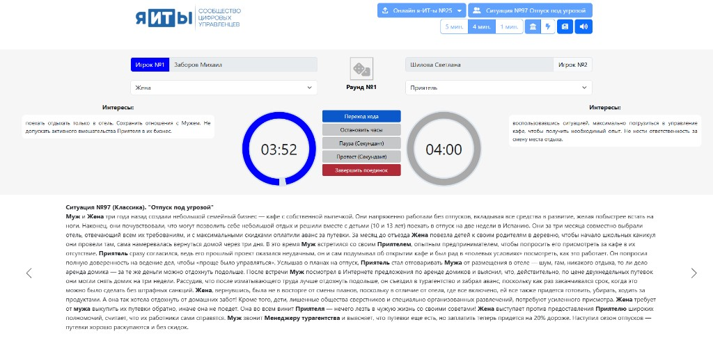
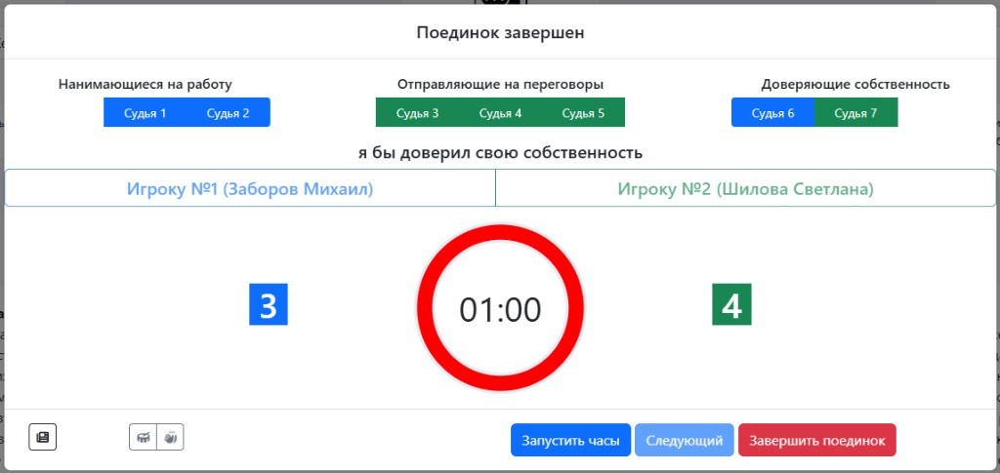
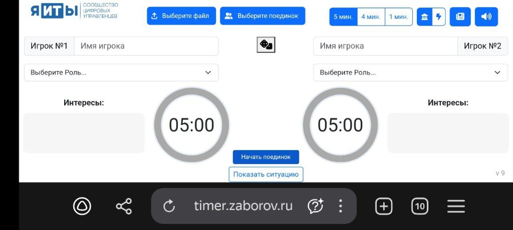
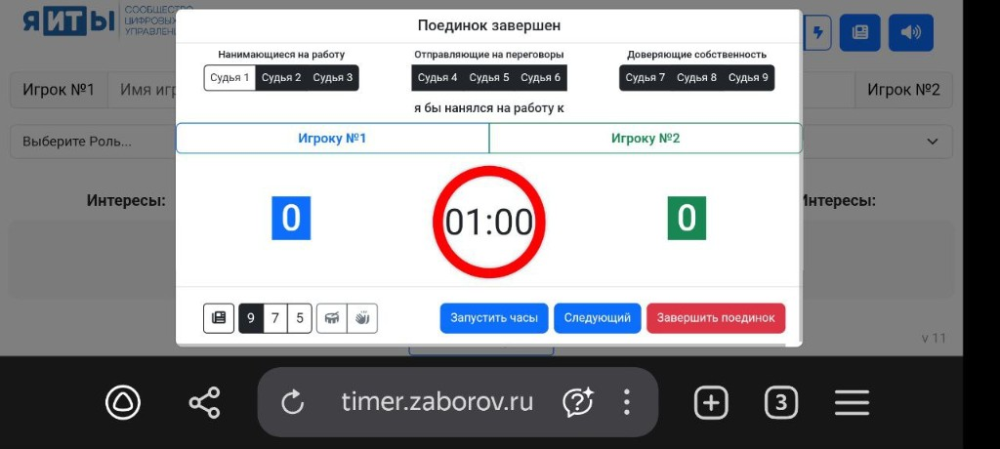

# Управленческие поединки - Часы
Этот проект представляет собой программу для управления временем в ходе управленческих поединков. 

посмотреть можно на https://timer.zaborov.ru

Главная страница - Ход поединка (выбор файла, поединка, настройка таймеров и ролей):

Форма завершения поединка (судьи, выбор игрока, таймер судей):

## Запуск и структура
- Открыть локально: `index.html` в браузере (для загрузки .xlsx/.json может понадобиться локальный сервер из-за CORS).
- **js/** — логика таймера и загрузки расписания (`timer-code.js`, `donutty.js`).
- **assets/Sound/** — звуки завершения поединка (аплодисменты, барабанная дробь).
- **fontawesome/** — иконки (Font Awesome).
- **scripts/** — деплой (`deploy.ps1` и др.).

## Функциональность
- Поддерживает классические  поединки и  экспресс:
  -   считается количество раундов
  -   ведется подсчет голосов судей
  -   есть функционал пауз и протестов
- можно заранее загружать расписание поединков с указанием игроков и текста ситуации (см **пример Онлайн я-ИТ-ы №16.xlsx**)
  - во время поединка показывается текст ситуации, текущие роли и их интересы (для классики) или агрессивная вводная фраза (для экспрессов)

## Звуки

**Включение и выключение**

В тулбаре есть переключатель звука (иконка динамика): чекбокс с иконкой «громко» / «выкл». По умолчанию звук включён. При выключении все звуки отключаются, текущие воспроизведения останавливаются (тиканье, гонг, гудок, барабанная дробь, аплодисменты, музыка жребия).

**Когда какие звуки играют**

- **Тиканье** (`clock_ticking.mp3`) — когда осталось мало времени: во время таймера судей (последние секунды) и во время таймера паузы. Останавливается при остановке часов, таймера судей или паузы.
- **Гонг** (`Gong.mp3`) — время текущего игрока закончилось (0), у второго ещё есть (переход хода); также при окончании времени паузы (0 сек).
- **Гудок** (`Gudok.mp3`) — время закончилось у обоих игроков (автоматическое завершение поединка).
- **Барабанная дробь** (`Drum_roll.mp3`) — по нажатию кнопки с иконкой барабана в форме завершения поединка (равный счёт, ждём оценку последнего судьи).
- **Аплодисменты** (`applause.mp3`) — по нажатию кнопки с иконкой аплодисментов; также по умолчанию при нажатии «Завершить поединок» (завершить без звука — **Shift+клик** по кнопке).
- **Музыка жребия (интро)** — при нажатии «Жребий» (ЛКМ по кнопке с иконкой кубика) воспроизводится трек из `assets/Sound/intro/` (список в `list.json`, при деплое обновляется автоматически). По умолчанию — случайный трек; конкретный трек задаётся через ПКМ по той же кнопке (меню с названиями композиций). Повторное нажатие на кнопку жребия останавливает музыку и досрочно выбирает игрока. Под кнопкой во время жеребьёвки показывается таймер обратного отсчёта до конца трека (исчезает по окончании или при досрочной остановке).

**Где лежат файлы**

- `assets/Sound/` — гонг, гудок, тиканье, барабанная дробь, аплодисменты.
- `assets/Sound/intro/` — треки для жребия; список в `assets/Sound/intro/list.json`.

## Формат файла расписания (Excel / JSON)

Поддерживаются файлы **.xlsx** (первая строка — заголовки столбцов, данные со второй) и **.json** (корень — массив объектов поединков).

| Поле | Описание |
|------|----------|
| **DuelNum** | Номер поединка в списке |
| **Player1** | Имя первого игрока |
| **Player2** | Имя второго игрока |
| **SituationNum** | Номер ситуации |
| **SituationName** | Название ситуации |
| **RefereeQty** | Количество судей: 9, 7 или 5 |
| **Type** | Тип поединка: `Классика` или `Экспресс` |
| **DuelMinutesLength** | Длительность раунда в минутах: 5, 4 или 1 |
| **SituationDescription** | Текст ситуации в HTML-разметке; возможные роли выделяются тегом `<strong>`, например `<strong>ИТ Директор</strong>` |
| **SituationRoles** | Роли: для **Классика** — массив `{ "Role": "роль", "Goals": "интересы" }`; для **Экспресс** — два объекта `{ "Role": "роль", "Phrase": "агрессивная фраза" }`. В Excel — строка с JSON в ячейке |

## Форма завершения поединка
- **Звуки:** две кнопки-иконки — барабанная дробь (равный счёт, ждём оценку последнего судьи) и аплодисменты (все судьи проголосовали, судья объявляет результат). Иконки — Font Awesome в папке `fontawesome/`.
- **Завершить поединок:** по умолчанию при нажатии воспроизводятся аплодисменты; завершить без звука — **Shift+клик** по кнопке. Подсказка отображается при наведении на кнопку.

## Протокол онлайна
- В тулбаре есть кнопка **«Скачать протокол»**: по нажатию формируется и скачивается файл Excel с протоколом онлайна. Имя файла: **«Протокол &lt;имя расписания&gt;.xlsx»** (например, при загруженном файле «Онлайн я-ИТ-ы №25.xlsx» — «Протокол Онлайн я-ИТ-ы №25.xlsx»).
- Длительности раундов считаются по **игровому времени** (таймеры/бублики), без учёта пауз и протестов. Время сохраняется при **переходе хода** и при **завершении поединка**. Поддерживается **произвольное число раундов**; в протоколе выводятся паузы, протесты (в т.ч. несколько в раунде) и роли по раундам (для классики).
- После подтверждения завершения поединка выбор автоматически переключается на **следующий поединок** в списке (если он есть); кнопки выбора файла и поединка снова становятся активными.

### Логика восстановления (для пользователей и разработчиков)

Ниже подробно описано, как сохраняется и восстанавливается состояние онлайна: при обновлении страницы, при работе с файлом статуса и при случайном закрытии формы судей.

#### Откуда берётся состояние

- **localStorage** (ключ `ub-timer-online-state`): сюда автоматически записывается состояние при выборе поединка, старте/остановке поединка, смене игрока, выборе роли, во время тика таймера в раунде и при голосовании/смене судьи. В объекте хранятся: имя файла расписания, список поединков (с результатами), **фаза** (`idle` / `round` / `judges`), выбранный поединок, время на часах обоих игроков, номер раунда, длительности прошедших раундов, роли по раундам, паузы и протесты, при фазе судей — голоса судей и активный судья, число судей (9/7/5) и т.д.
- **Фазы:**
  - **idle** — поединок не идёт, форма судей не открыта; сохраняется только выбранный поединок.
  - **round** — идёт раунд; сохраняются время, раунд, активный игрок, длительности, роли, паузы/протесты.
  - **judges** — открыта форма голосования судей; дополнительно сохраняются голоса и активный судья.

#### Баннер «Восстановить последний онлайн?»

- Появляется при загрузке/обновлении страницы, если в localStorage есть сохранённые данные и при этом либо есть «реальные» данные протокола (победители, длительности раундов, голоса), либо фаза была `round` или `judges` (активная сессия).
- **«Да»** — восстанавливаются имя файла расписания и список поединков, отображается список; восстанавливается выбранный поединок (ситуация, имена, роли из расписания). Если фаза была **round**: на экране восстанавливаются часы (остановлены), номер раунда, время у каждого игрока, длительности раундов, текущий игрок, выбранные роли для текущего раунда; кнопка «Завершить поединок» активна. Если фаза была **judges**: то же состояние раунда плюс открывается модалка формы судей с восстановленным количеством судей (9/7/5), голосами и активным судьёй.
- **«Нет»** — баннер скрывается; восстановление не выполняется (расписание и список поединков можно загрузить заново из файла).
- **«Очистить»** — данные в localStorage удаляются, баннер скрывается.

#### Кнопки на баннере

- **«Сохранить статус онлайна»** — скачивается один файл .xlsx с тремя вкладками: «Протокол» (игроки, победитель, голоса судей по поединкам), «Раунды» (длительности, роли, паузы, протесты по раундам), «Состояние сессии» (текущая фаза, поединок, время, раунд, судьи и т.д. в виде «ключ — значение»). Если в момент сохранения открыта форма судей, голоса текущего поединка в «Протокол» подставляются из текущего состояния (localStorage), а не только из уже завершённых поединков.

#### Загрузка статуса онлайна (выпадающее меню «Выберите файл»)

- Пункт **«Загрузить статус онлайна»** в меню под кнопкой «Выберите файл» по умолчанию **неактивен**. Он становится активным только **после загрузки файла расписания** (.xlsx или .json). Так обеспечивается соответствие: статус загружается поверх уже открытого расписания.
- После выбора файла .xlsx приложение:
  1. **Не пересоздаёт** список поединков с нуля: из листа «Протокол» по индексу колонок обновляются только поля уже загруженных поединков (игроки, победитель, голоса судей).
  2. Из листа «Раунды» заполняются длительности раундов, роли, паузы и протесты по каждому поединку.
  3. Если есть лист «Состояние сессии», по нему восстанавливается этап: фаза, выбранный поединок, время на часах, раунд, голоса судей, число судей и т.д. — по той же логике, что и при «Восстановить последний онлайн» (см. выше).
  4. Состояние записывается в localStorage, баннер восстановления скрывается.

#### Форма голосования судей: кнопка «Вернуть голосование»

- Кнопка **«Вернуть голосование»** (под кнопкой «Начать поединок») показывается в фазе **idle**, если только что был завершён поединок: вы нажали «Завершить поединок» в форме судей, модалка закрылась и выбор переключился на следующий поединок — в этот момент кнопка появляется.
- По нажатию открывается форма голосования **не для текущего (подсвеченного) поединка, а для предыдущего** — того, который только что завершили. Восстанавливаются количество судей (9/7/5) и все проставленные голоса из сохранённого результата.
- Кнопка скрывается, когда вы **начинаете следующий поединок** («Начать поединок» для следующего в списке).

#### Краткая памятка для пользователей

| Ситуация | Действие |
|----------|----------|
| Обновили страницу / открыли снова | Если появился баннер — «Восстановить последний онлайн?» → **Да** для восстановления этапа (раунд или судьи). |
| Хотите перенести/бэкап онлайна | **Сохранить статус онлайна** → сохранить .xlsx. Потом на другом устройстве/браузере: загрузить **расписание**, затем **Загрузить статус онлайна** и выбрать этот .xlsx. |
| Завершили поединок, хотите снова посмотреть голосование | В фазе idle под кнопкой «Начать поединок» нажать **«Вернуть голосование»** — откроется форма судей для **предыдущего** поединка. |
| Загрузить статус без расписания | Сначала загрузить файл расписания («Загрузить расписание»), затем в меню станет доступно «Загрузить статус онлайна». |

**Структура протокола (Excel):** при **«Скачать протокол»** и при **«Сохранить статус онлайна»** в файл входят листы «Протокол» и «Раунды»; при «Сохранить статус онлайна» добавляется третий лист — «Состояние сессии» (см. раздел «Логика восстановления» выше).

**Лист «Протокол»** — общие данные по поединкам (столбцы = поединки):

| Столбец A (метка) | Столбцы B, C, D… (Поединок 1, 2, 3…) |
|-------------------|----------------------------------------|
| Игрок 1 | Имя первого игрока |
| Игрок 2 | Имя второго игрока |
| Победитель | Имя победителя (или пусто) |
| Судья 1 … Судья N | Голос судьи: 1 или 2 (N = max количества судей, 9/7/5) |

**Лист «Раунды»** — по одной строке на раунд поединка:

| Поединок | Раунд | Длительность | Игрок 1 Роль | Игрок 2 Роль | Время паузы | Протесты |
|----------|-------|--------------|---------------|--------------|-------------|----------|
| 1 | 1 | 2:30 | … | … | 1:45 | |
| 1 | 2 | 3:00 | … | … | | 0:50, 1:20 |

Роли — только для классики; в колонке «Протесты» — список времён через запятую (протестов может быть несколько в раунде).

## Мобильная вёрстка и десктоп
- **Десктоп** (ширина ≥993px): подключается только `css/timer.css`. Ретестить десктоп после правок мобилки не нужно.
- **Мобильная вёрстка** (≤992px): подключается `css/timer-mobile.css`. Все мобильные элементы в разметке помечены классом `mobile-only` и в `timer.css` на десктопе жёстко скрыты. Новые мобильные фичи: правки только в `timer-mobile.css` и в HTML с классом `mobile-only`.

Мобильные скриншоты:
Главная страница - Ход поединка (выбор файла, поединка, настройка таймеров и ролей):

Форма завершения поединка (модалка «Поединок завершен» — судьи, выбор игрока, таймер, кнопки):

## Технологии
- Фронтенд без сборки: HTML, CSS, JavaScript.
- [SheetJS](https://sheetjs.com/) (XLSX) — чтение расписания и запись протокола онлайна в браузере.
- Таймер — кастомный донат/круговой индикатор (donutty) в `js/donutty.js`.
