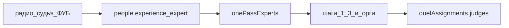

# План 4 — Судьи эксперты (судья ФУБ)

**Статус: выполнен (2026-08-06…08, прод v69), сдан в архив.**

Независимый план. Не включает загрузку из Google, случайный поединок и live-протокол.

## Цель

В форме **«Участники и судьи»** → вкладка **«Участники»** → колонка **«Особенности назначения»** — пометка для приглашённых профессиональных судей (экспертов в технологии поединков) и учёт в автоназначении.

## Согласованные правила

| # | value | Подпись |
|---|-------|---------|
| 1 | `none` | — |
| 2 | `novice` | новичок |
| 3 | `experienced` | опытный |
| 4 | `expert` | **судья ФУБ** |
| 5 | `org` | орг |

1. **Игры/секундирование:** обычно не играют, но не запрещено; инварианты как у всех (не судят свой поединок).
2. **Лимит:** нет — использовать судей ФУБ по максимуму.
3. **Коллегии:** Отправляющие → Доверяющие → (если ещё много) Нанимающиеся. Экспресс — тоже приоритет на «Отправляющие».
4. **Соседство:** мягче; для коллегий из 1 слота соседство не учитывается.
5. **Орг** без изменений — хвост autofill.

## Реализация

- UI + `setPersonExperience` / `people.experience` в [`js/schedule.js`](../../js/schedule.js), комментарий в [`js/state.js`](../../js/state.js).
- Проход **0** в `runJudgesAutofill` (`onePassExperts`); исключение expert из шагов 1–3 и раундов 2+.
- Приоритет expert в `findBestCandidateForSlot` и одно-поединковом autofill.
- README: пометка и проход 0.

## Вне скоупа

- План 2 / план 3
- Новые коллегии на форме голосования
