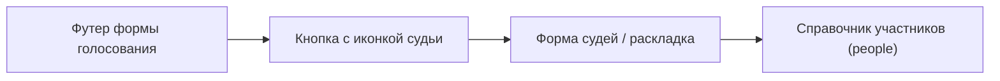

### Цели

- **Управление участниками и судьями** прямо из приложения ("часов").
- **Автоматическое и ручное формирование коллегий судей** по поединкам с контролем конфликтов и нагрузкой.
- **Улучшение формы голосования**: имена судей, отзыв голосов, связь с формой судей.
- **Экспорт в протокол Excel** с ФИО судей и их голосами.
- **Сохранение/восстановление контекста и поддержка мобильной вёрстки.**

### 1. Модель данных для людей и ролей

- **Расширить структуру состояния онлайна** (объект, который пишется в `localStorage` под ключом `ub-timer-online-state`):
  - Добавить раздел `people` — словарь по ID:
    - `id`, `fullName`, `isActive`, `experience` (`"novice" | "experienced" | "none"`), опционально пометка (`notes`).
  - Добавить раздел `duelAssignments` — по `duelIndex`:
    - `players` (сыграно как сейчас, но храним ссылку на `peopleId` при совпадении по имени).
    - `seconds` (если секунданты появятся в расписании / вручную).
    - `judges` — массив из 9 позиций (максимум), каждая: `{ personId, category: "hiring" | "negotiators" | "owners" }`.
- **Привязка к уже существующим данным**:
  - При загрузке расписания инициализируем `people`: по всем поединкам создаём/переиспользуем записи для всех игроков и секундантов из расписания (имена из полей `Player1`/`Player2` и соответствующих полей для секундантов, если они есть).
  - При ручном добавлении участника в форме судей он тоже попадает в `people`.
- **Инварианты:**
  - Один `personId` может участвовать в одном поединке максимум один раз и в одной роли (игрок/секундант/судья).
  - Флаг `isActive=false` исключает человека из будущих автоматических раскладок, но не трогает уже созданные назначения (можно управлять как именно при пересчёте).

### 2. UI: общая форма судей и участников (вкладки)

- **Вызов формы**:
  - В выпадающем меню под кнопкой `"Выберите файл"` добавить пункт `"Участники и судьи"`, который открывает общее модальное окно.
  - Из модалки завершения поединка эта же форма открывается по кнопке с иконкой судьи (та же кнопка используется и из формы голосования).
- **Структура формы (вкладки)**:
  - Внутри одной модалки сделать две основные вкладки:
    - Вкладка **"Список участников онлайна"** — справочник всех людей (игроки, секунданты, потенциальные судьи).
    - Вкладка **"Раскладка судей"** — табличный вид по поединкам, близкий к Excel-макету.
  - Логика открытия по умолчанию:
    - Если ни один поединок ещё не начинался (нет результатов и фаз round/judges в состоянии) — по умолчанию открывается вкладка **"Список участников онлайна"**.
    - Если уже есть начатые/сыгранные поединки — по умолчанию открывается вкладка **"Раскладка судей"**.

### 3. UI: вкладка «Судьи» (раскладка по поединкам) — реализовано

- **Таблица раскладки**:
  - Первая колонка — **«Блок / позиция»**; заголовки колонок поединков — «Поединок N (прошёл / текущий / будущий)».
  - Строки: Игрок, Секундант (×2), затем судейские — **Нанимающиеся 1…**, **Отправляющие 1…**, **Доверяющие 1…** (без слова «Судья» в подписи). Набор строк зависит от типа расписания (все экспресс / все классика) и количества судей (5/7/9); лишние строки не показываются.
  - **Двойной клик** по ячейке открывает выпадающий список для назначения/замены судьи; в списке показываются только те, кого можно назначить (занятые в этом поединке — игроки, секунданты — в список не попадают).
  - **ПКМ** по ячейке — контекстное меню: «Очистить», «Поменять местами» (с подсветкой доступных ячеек, в т.ч. в других незавершённых поединках), «Не может на этот поединок», «Отключился со встречи» (см. разд. 5а).
  - Прошедшие поединки — колонка серая, только чтение; текущий и будущие — редактируемые.
- **Кнопки**:
  - **«Автоназначение судей»** — заполняет судей по всем поединкам (логика — см. разд. 4).
  - В заголовке колонки поединка (для незавершённых) — выпадающее меню: **«Назначить судей на этот поединок»**.

### 3а. UI: вкладка «Участники» (реализовано)

- **Вызов формы:** меню «Выберите файл» → «Участники и судьи»; пункты «Участники и судьи» и «Скачать протокол» по умолчанию неактивны и включаются вместе с «Загрузить статус онлайна» при наличии загруженного расписания.
- **Вкладки модалки:** «Участники» и «Судьи»; при переключении на вкладку таблица перерисовывается (участники или раскладка судей по поединкам).
- **Вкладка «Участники»**:
  - Над таблицей: поле **«ФИО нового участника»** и кнопка **«Добавить участника»** (поиск по таблице убран).
  - Таблица: колонки **№** (порядковый номер), **ФИО**, **Статус** (активен/неактивен), **Особенности назначения**, **Судит**, **Игр**.
  - **Особенности назначения** — группа радиокнопок: «—» (без пометки), «новичок», «опытный», «орг». «Орг» в автоназначении используется только в дополнительном проходе для ещё пустых слотов.
  - **Судит** / **Игр** — только чтение (считаются по `duelAssignments`: сколько раз судил, сколько раз играл).
  - При пустом списке участников показывается одна строка-подсказка.
  - Кнопки «Сделать неактивным» и фильтры убраны; все изменения сразу в `people` и localStorage.

Макет формы судей: 5 поединков — 2 прошедших, 1 текущий, 2 будущих (колонки можно прокручивать).

| Блок / позиция         | Поединок 1 (прошёл) | Поединок 2 (прошёл) | Поединок 3 (текущий) | Поединок 4 (будущий) | Поединок 5 (будущий) |
| ---------------------- | ------------------- | ------------------- | -------------------- | -------------------- | -------------------- |
| Команда 1 — Участник   | Иванов              | Петрова             | Сидоров              | Козлова              | Новиков              |
| Команда 1 — Секундант  | Петров              | Сидорова            | Козлов               | Новикова             | …                    |
| Команда 2 — Участник   | Кузнецова           | Смирнов             | Волкова              | Федоров              | …                    |
| Команда 2 — Секундант  | Смирнова            | Волков              | Федорова             | …                    | …                    |
| Нанимающиеся — Судья 1 | Склярова            | …                   | …                    | …                    | …                    |
| Нанимающиеся — Судья 2 | Мельник             | …                   | …                    | …                    | …                    |
| Нанимающиеся — Судья 3 | Заборов             | …                   | …                    | …                    | …                    |
| Отправляющие — Судья 4 | Рашевский           | …                   | …                    | …                    | …                    |
| Отправляющие — Судья 5 | Елисеева            | …                   | …                    | …                    | …                    |
| Отправляющие — Судья 6 | Окулова             | …                   | …                    | …                    | …                    |
| Отправляющие — Судья 7 | Шабунина            | …                   | …                    | …                    | …                    |
| Доверяющие — Судья 8   | Кузьмина            | …                   | …                    | …                    | …                    |
| Доверяющие — Судья 9   | Ильина              | …                   | …                    | …                    | …                    |

- **Колонки 1–2 (прошедшие):** серый фон, только чтение.
- **Колонка 3 (текущий):** выделена; можно менять судей и переключать подтверждение участия (белый/зелёный).
- **Колонки 4–5 (будущие):** редактируемые, без режима подтверждения.
- Для **классики** используются все три коллегии; для **экспресса** — только блок «Отправляющие на переговоры» (5 позиций), остальные судейские строки по этому поединку неактивны/серые.

### 4. Автоматическая раскладка судей (реализовано)

- **Кнопки**:
  - **«Автоназначение судей»** — одна кнопка в форме раскладки: заполняет судейские слоты по **всем** поединкам (текущий и будущие), не трогает прошедшие.
  - **По одному поединку:** в заголовке колонки поединка (для незавершённых) — выпадающее меню с пунктом **«Назначить судей на этот поединок»**: заполняются только слоты этого поединка.
- **Вспомогательные данные**:
  - **Сколько раз судит** — `countTimesJudged(personId)` по `duelAssignments`.
  - **Сколько раз играет** — `countTimesPlayed(personId)` (игрок в поединке).
  - **Сколько раз секундирует** — `countTimesSeconded(personId)` (назначен Second1/Second2 хотя бы в одном поединке).
  - **«Только судья»** — человек с 0 игр и 0 секундирований (ни разу не играл и не секундировал в расписании).
  - **Категория слота** — `getSlotCategory(duelIdx, slotKey)`: `"hiring"` (Нанимающиеся), `"negotiators"` (Отправляющие), `"owners"` (Доверяющие); для экспресса все судейские слоты — переговорные.
- **Алгоритм полного автоназначения (все поединки) — 5 проходов**:
  1. **Проход 1 — только судьи:** назначаются только те, у кого 0 игр и 0 секундирований; не более **3 слотов** на человека за один запуск; сортировка по нагрузке (`timesJudged`), чтобы раскидать по разным поединкам/коллегиям.
  2. **Проход 2:** оставшиеся пустые слоты заполняются **секундантами** (кто уже секундирует в расписании), без оргов; по нагрузке и опытности.
  3. **Проход 3:** оставшееся — **игроками** (уже играли в поединках), без оргов.
  4. **Проход 4:** оставшееся — **оргами** (опыт «орг»).
  5. **Проход 5 — правка по опытности:** в каждом поединке, если новичок попал в Доверяющие/Отправляющие, а опытный — в Нанимающиеся, они **меняются местами** (предпочтительно: опытные в Доверяющие/Отправляющие, новички в Нанимающиеся).
- **Назначение на один поединок** (кнопка в заголовке колонки):
  - Два прохода: сначала без оргов, затем в оставшиеся слоты — орги. Приоритет кандидатов: **только судьи** (0 игр, 0 сек) → секунданты → игроки → орги; внутри группы — по нагрузке и опытности (в Нанимающиеся в первых поединках предпочтительнее новички).
- **Общие правила**:
  - Исключаются только явно неактивные (`isActive === false`). Игроки и секунданты поединка в список кандидатов на судейство в этом поединке не попадают.
  - Прошедшие поединки автоназначение не меняет.

### 5. Ручная корректировка и контроль конфликтов

- **Валидация при ручном выборе в ячейке**:
  - Если выбран человек, который уже является игроком/секундантом/судьёй в этом же поединке — показывать предупреждение и блокировать выбор (или разрешать только через явное подтверждение `"Всё равно назначить"`).
  - При попытке назначить человека, который уже судит в этот же момент в другом поединке (если встречаются параллельные поединки в расписании) — опционально подсвечивать, но не блокировать (можно на втором этапе).
- **Ограничение "1 человек — 1 роль в поединке"**
  - Гарантировать на уровне данных (`duelAssignments`) и при формировании протокола, чтобы одна и та же `personId` не фигурировала дважды в одном `duelIndex`.

### 5а. Контекстное меню: «Поменять местами», «Не может на этот поединок», «Отключился со встречи» (план)

- **Поменять местами (с подсветкой)**  
  - По ПКМ по судейской ячейке → «Поменять местами» → режим обмена:  
    - **Подсветка 1:** ячейка-источник (которую меняем).  
    - **Подсветка 2:** ячейки, **доступные для обмена** — любая другая судейская ячейка в **незавершённом** поединке, в которой стоит человек (обмен «человек на человека»). Доступна только если после обмена **никто не участвует дважды в одном поединке**: человек из источника не занят в поединке целевой ячейки в других слотах, человек из целевой ячейки не занят в поединке источника в других слотах.  
    - **Подсветка 3:** остальные ячейки (недоступные для обмена).  
  - Клик по доступной ячейке выполняет обмен и снимает подсветку; клик вне / Escape — выход без изменений.

- **Не может на этот поединок**  
  - Пункт контекстного меню по ячейке с назначенным человеком.  
  - Действия: (1) очистить этот слот; (2) записать человека в **исключения на этот поединок** (хранить под капотом, например `excludedFromDuel[duelIdx]` — множество `personId`); (3) **найти одну замену** по приоритетам автоназначения (нагрузка, опыт, соседство, орг в последнюю очередь), без пересчёта всего расписания; (4) ручное назначение этого человека в этот поединок по-прежнему разрешено. Отображение списка исключений в UI не делаем.

- **Отключился со встречи**  
  - Пункт контекстного меню по ячейке.  
  - Действия: (1) пометить человека **неактивным** (`isActive = false`); (2) найти **одну замену** на текущий поединок (как в п. «Не может на этот поединок»); (3) **пересчитать все будущие поединки** (очистить судейские слоты для поединков от текущего до конца и заново заполнить их логикой автоназначения с учётом исключений и неактивных).

- **Данные:** исключения на поединок (`excludedFromDuel`) сохранять вместе с протоколом/localStorage; при автоназначении и при подборе замены кандидатов из этого поединка не рассматривать.

### 6. Форма голосования судей

- **Имена вместо номеров**:
  - В блоке кнопок судей (`refBut0..refBut10` в `index.html`) подставлять короткие подписи:
    - Если для позиции есть назначенный `personId` → показывать сокращённое ФИО (например, `"И. Иванов"`), полный текст — в `title`/tooltip.
    - Если нет назначенного судьи → показывать `"Судья 1"`, как сейчас.
  - Шрифт слегка уменьшить, добавить `text-overflow: ellipsis` и `title` для полного имени, чтобы не ломать вёрстку.
- **Отзыв голоса**:
  - Функцию `refereeVote` доработать: повторный клик по активному голосу этого судьи снимает его голос (ставит `null` для ячейки в `JudgeVotes` и визуально сбрасывает подсветку).
  - Обновить расчёт счёта (`Player1Score`/`Player2Score`) так, чтобы он учитывал только непустые голоса.
- **Связь с формой судей**:
  - В футере формы голосования вместо селектора количества судей (5/7/9) используется одна кнопка с иконкой судьи, открывающая форму судей/раскладки.
  - Если для текущего поединка есть явные `personId` в `duelAssignments.judges`, то количество судей можно менять только внутри формы судей; из формы голосования доступен только вход в эту форму.

### 7. Протокол Excel и сохранение статуса онлайна

- **Структура протокола (лист "Протокол")**:
  - Добавить строку `"Тип поединка"` сразу после строк игроков: в ячейках — `Классика` или `Экспресс` по данным поля `Type`.
  - Перед строками судей добавить блок `"Судья 1".."Судья N"` с ФИО судей столбцом (как на скрине):
    - Отдельные строки в начале листа: `"Судья 1"`, `"Судья 2"`, ...; в ячейках — ФИО из `duelAssignments.judges` для каждого поединка.
  - Существующие строки с голосами судей (1/2) оставить как есть, но логически привязать к соответствующим ФИО.
  Макет листа «Протокол» (столбцы B, C, D… = поединки):

  | Строка (колонка A) | Поединок 1          | Поединок 2 | …   |
  | ------------------ | ------------------- | ---------- | --- |
  | Игрок 1            | ФИО                 | ФИО        | …   |
  | Игрок 2            | ФИО                 | ФИО        | …   |
  | Тип поединка       | Классика / Экспресс | …          | …   |
  | Победитель         | ФИО                 | ФИО        | …   |
  | Судья 1            | ФИО судьи           | ФИО судьи  | …   |
  | Судья 2            | ФИО судьи           | …          | …   |
  | …                  | …                   | …          | …   |
  | Судья N            | ФИО судьи           | …          | …   |
  | Судья 1 Голос      | 1 или 2             | 1 или 2    | …   |
  | Судья 2 Голос      | 1 или 2             | …          | …   |
  | …                  | …                   | …          | …   |
  | Судья N Голос      | 1 или 2             | …          | …   |

- **Лист "Состояние сессии" при "Сохранить статус онлайна"**:
  - Добавить сериализацию разделов `people` и `duelAssignments` (например, как JSON-строки по ключам `people`, `duelAssignments`).
  - При загрузке статуса восстанавливать эти структуры и перезаполнять UI форм судей и имён в голосовании.
  - Убедиться, что поле `Type` для каждого поединка также сохраняется и восстанавливается, чтобы тип поединка в протоколе и логика экспресса/классики были консистентны.

### 8. Мобильная вёрстка

- **Отдельные mobile-only элементы**:
  - Для справочника людей — упрощённая модалка со списком и полноэкранным режимом (класс `mobile-only` + стили в `css/timer-mobile.css`).
  - Для формы раскладки поединка — переключение по поединкам свайпом или вертикальный список поединков с раскрывающимися блоками судей.
- **Проверка вёрстки**:
  - Не трогать десктопный `timer.css`, кроме минимальных правок шрифтов для кнопок судей.
  - Основные мобильные адаптации добавить в `timer-mobile.css`.

### 9. Восстановление контекста

- **Интеграция с существующей логикой `sessionPhase`**:
  - При открытии/закрытии модалок судей/справочника не менять `sessionPhase`, чтобы текущее состояние (round/judges) не ломалось.
  - Все изменения в `people` и `duelAssignments` сразу писать в объект состояния и вызывать существующую функцию сохранения в `localStorage`.
  - При восстановлении из `localStorage` или файла статуса дополнительно инициализировать формы: подставить имена судей в кнопки, заполнить таблицу раскладки.

### 10. Поэтапная реализация

- **Этап 1**: модель данных `people`/`duelAssignments` + простая модалка справочника участников из меню.
- **Этап 2**: форма раскладки судей по поединку (табличный вид), базовая авто-раскидка без сложной оптимизации коллегий.
- **Этап 3**: улучшенный алгоритм разнообразия коллегий и балансировки нагрузки + пересчёт при изменениях активности.
- **Этап 4**: доработка формы голосования (имена судей, отзыв голосов, блокировка изменения количества судей).
- **Этап 5**: расширение протокола Excel и сохранения статуса онлайна под новые структуры + финальная мобилка.

