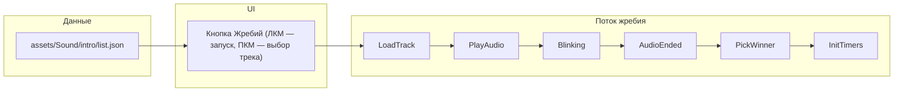

# Жребий с музыкой интро и выбором трека

## Текущее состояние

- Жребий в [js/timer-code.js](js/timer-code.js): `dice()` запускает `blinking(count, step, qty)` с случайной длительностью 1600–2600 ms, шаг 200 ms; результат зависит от чётности числа шагов.
- Звук: в проекте уже используются `new Audio(...)`, `stopAudio()`, `soundsEnabled` ([js/timer-code.js](js/timer-code.js) ~51–55, 1023–1027).
- Кнопка жребия в [index.html](index.html) в блоке `name-and-role__dice` (col-2 между полями игроков).

## Архитектура решения

- При загрузке страницы: запрос `assets/Sound/intro/list.json` (массив имён файлов), по нему строятся данные для меню по ПКМ по кнопке жребия.
- По нажатию «Жребий»: выбор трека (значение списка = «Случайный» → случайный из list.json, иначе выбранный файл), воспроизведение этого файла, запуск равномерного мигания.
- Остановка по событию `ended` у аудио: остановка мигания, выбор игрока 50/50, применение результата, `initTimers()`.

## 1. Данные и папка

- Папка: **assets/Sound/intro/** — файлы с музыкой уже залиты (Baba_O_Riley.mp3, Sweet_Home_Alabama.mp3, Bad_To_The_Bone.mp3, Deutschland.mp3, Stop_the_Rock.mp3, Cant_Stop.mp3, Jamming.mp3, Tatarskaya_plyasovaya.mp3, Misirlou.mp3, Peremen.mp3, Masha_i_medvedi.mp3, Eye_Of_The_Tiger.mp3 и др.).
- Файл **assets/Sound/intro/list.json** — массив имён файлов (например `["Baba_O_Riley.mp3", "Sweet_Home_Alabama.mp3", ...]`). **При деплое** список обновляется автоматически (см. п. 6).

## 2. Разметка (index.html)

- **Отдельный элемент не добавлять.** Вся логика — на одной кнопке жребия (`id="dice_button"`):
  - **ЛКМ** по кнопке — запуск жребия (музыка + мигание; трек берётся случайный по умолчанию или тот, что выбран через ПКМ ранее).
  - **ПКМ** по кнопке — показать выпадающий список (контекстное меню или Bootstrap dropdown): пункт «Случайный» + названия композиций из list.json; при выборе пункта запомнить в JS (переменная, например `selectedIntroTrack`: пусто/`"random"` = случайный, иначе имя файла) для следующего запуска жребия.
- На время работы жребия отключать только кнопку жребия (disabled).

## 3. Логика в timer-code.js

**Загрузка списка треков**

- При загрузке страницы выполнить `fetch("assets/Sound/intro/list.json")`, распарсить JSON, сохранить массив имён файлов в переменную (например `introTracksList`). Использовать для: выбора трека при ЛКМ (случайный или выбранный ранее), построения меню при ПКМ по кнопке жребия. Текущий выбор хранить в переменной (например `selectedIntroTrack`: `""` или `"random"` = случайный, иначе имя файла). При ошибке/404 — пустой массив, только «Случайный» в меню.

**Переменные**

- Хранить id таймера мигания для интро (например `introBlinkTimeoutId`), чтобы по окончании музыки вызвать `clearTimeout(introBlinkTimeoutId)`.
- Хранить ссылку на текущий интро-аудиообъект (например `audioIntro`), чтобы при завершении жребия вызывать `stopAudio(audioIntro)` при необходимости.

**dice()**

- Считать выбранный трек из переменной (`selectedIntroTrack`). Если «Случайный» (пусто или `"random"`) — взять случайный элемент из `introTracksList`, иначе использовать сохранённое имя файла.
- Сформировать путь: `assets/Sound/intro/<имя_файла>`.
- Создать `new Audio(path)`, сохранить в `audioIntro`, подписаться на `ended`: в обработчике отменить мигание (`clearTimeout(introBlinkTimeoutId)`), выбрать стартующего игрока `whoStarts = Math.random() < 0.5 ? 1 : 2`, выставить его (и при необходимости поменять местами имена в полях и в `duelsList`), вызвать `initTimers()`, отключить воспроизведение/очистить ссылку, снова включить кнопку жребия.
- Учесть `soundsEnabled`: если звук выключен — интро не воспроизводить; мигание идёт с той же длительностью, что и сейчас (1600–2600 ms случайно), затем та же финальная логика (whoStarts, initTimers).
- **Повторное нажатие на кнопку жребия** во время работы: останавливать музыку (`stopAudio(audioIntro)`), отменять мигание (`clearTimeout(introBlinkTimeoutId)`), сразу выбирать случайного игрока 50/50, применять результат, `initTimers()`, включить кнопку (то же, что по окончании музыки).
- Запустить равномерное мигание (см. ниже), перед этим отключить кнопку жребия.

**Мигание под интро**

- Вынести «один шаг» мигания в функцию (как сейчас: обмен имён Player1/Player2, обновление `duelsList`, `newPlayer = qty % 2 + 1`, `setPlayer`, `highlightPlayer`), но без уменьшения `count` и без условия по длительности.
- Новая функция `blinkingIntroStep(qty)` выполняет один шаг и планирует следующий через `setTimeout(..., 200)`, сохраняя id в `introBlinkTimeoutId`; при следующем вызове увеличивать `qty`. Остановка только из обработчика `audio.ended` (или таймаута при выключенном звуке) через `clearTimeout(introBlinkTimeoutId)`.
- Старую `blinking(count, step, qty)` можно оставить для обратной совместимости или удалить, если жребий всегда будет только с интро; в текущем плане жребий всегда идёт через интро (или через фиксированное время при отключённом звуке).

**Выключенный звук**

- Если `soundsEnabled === false`: не создавать/не воспроизводить аудио; запустить мигание с длительностью **как сейчас** — `1600 + Math.ceil(Math.random() * 1000)` ms (шаг 200 ms), по истечении выполнить ту же финальную логику (остановить мигание, выбрать whoStarts 50/50, применить, initTimers, включить кнопку).

## 4. Список треков и меню по ПКМ

- Меню по ПКМ по кнопке жребия строится из загруженного массива (порядок из list.json): первый пункт «Случайный», далее пункты по одному на каждый файл (подпись — имя без `.mp3` или как есть).

## 5. Важно

- Путь к list.json и к файлам: единый базовый путь `assets/Sound/intro/` (учитывать при деплое и при открытии через file:// при необходимости).
- При ошибке загрузки list.json или пустом массиве: в списке только «Случайный»; при нажатии «Жребий» с «Случайный» и пустым списком — не воспроизводить аудио, работать только мигание (при звуке вкл. — по ended; при звуке выкл. — 1600–2600 ms) и затем выбор игрока.

## 6. Деплой: обновление list.json

- В [scripts/deploy.ps1](scripts/deploy.ps1) **перед** загрузкой файлов добавить шаг: сгенерировать **assets/Sound/intro/list.json** по содержимому папки **assets/Sound/intro/** — получить список файлов `*.mp3`, отсортировать по имени, записать в list.json массив имён (например `["Bad_To_The_Bone.mp3", "Baba_O_Riley.mp3", ...]`). После записи добавить этот файл в список на загрузку (если его ещё нет в `$toUpload`), чтобы на проде всегда был актуальный список треков после выкладки новых mp3.

## 7. README: раздел про звуки

В [README.md](README.md) добавить раздел **«Звуки»**, в котором описать **когда и какие звуки воспроизводятся** и **как их включать/выключать**.

**Включение и выключение**

- В тулбаре есть переключатель звука (иконка динамика): чекбокс с иконкой «громко» / «выкл». По умолчанию звук включён. При выключении все звуки отключаются (и текущие воспроизведения останавливаются): тиканье, гонг, гудок, барабанная дробь, аплодисменты, интро жребия.

**Когда какие звуки играют**

- **Тиканье** (`clock_ticking.mp3`) — когда осталось мало времени: во время таймера рефери (последние секунды перед окончанием минуты) и во время таймера паузы (последние секунды). Останавливается при остановке часов, при остановке таймера рефери или паузы.
- **Гонг** (`Gong.mp3`) — время текущего игрока закончилось (0), у второго ещё есть — переход хода; также при окончании времени паузы (0 сек).
- **Гудок** (`Gudok.mp3`) — время закончилось у обоих игроков — автоматическое завершение поединка.
- **Барабанная дробь** (`Drum_roll.mp3`) — по нажатию кнопки с иконкой барабана в форме завершения поединка (ситуация «равный счёт, ждём оценку последнего судьи»).
- **Аплодисменты** (`applause.mp3`) — по нажатию кнопки с иконкой аплодисментов; также по умолчанию при нажатии «Завершить поединок» (завершить без звука — **Shift+клик** по этой кнопке).
- **Музыка жребия (интро)** — при нажатии «Жребий» (ЛКМ по кнопке с иконкой кубика) воспроизводится трек из папки `assets/Sound/intro/` (список в `list.json`, при деплое обновляется автоматически). По умолчанию — случайный трек; конкретный трек задаётся через ПКМ по той же кнопке (меню с названиями композиций). Повторное нажатие на кнопку жребия останавливает музыку и досрочно выбирает игрока.

**Где лежат файлы**

- `assets/Sound/` — гонг, гудок, тиканье, барабанная дробь, аплодисменты.
- `assets/Sound/intro/` — треки для жребия; список в `assets/Sound/intro/list.json`.

## Итог по файлам

- **Генерация при деплое / создание начального:** [assets/Sound/intro/list.json](assets/Sound/intro/list.json)
- **Разметка:** кнопка жребия остаётся единственным элементом; при необходимости добавить обработчик `contextmenu` и разметку для меню по ПКМ (например скрытый контейнер для Bootstrap dropdown) — [index.html](index.html)
- **Логика:** загрузка list.json, dice, мигание, остановка по ended или по повторному клику, звук вкл/выкл, финал 50/50 — [js/timer-code.js](js/timer-code.js)
- **Деплой:** обновление list.json по папке intro — [scripts/deploy.ps1](scripts/deploy.ps1)
- **Документация:** раздел «Звуки» — [README.md](README.md)

После реализации: новые mp3 кладутся в `assets/Sound/intro/`; при деплое list.json обновляется автоматически. Одна кнопка жребия: ЛКМ — запуск жребия, ПКМ — выбор трека для следующего запуска. Повторный клик по жребию — остановка и досрочный выбор.

