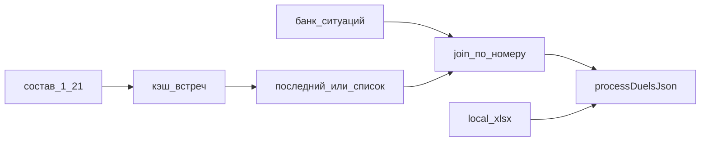

# План 1 — Расписание из Google

**Статус: выполнен (2026-08-04), сдан в архив.**

Независимый план. Не включает случайный поединок и live-протокол.

## Цель

Загрузить `duelsList` из Google и дальше идти тем же путём, что после локального `.xlsx`/`.json`.

## Решение (2026-08-04)

- **Источник состава:** лист «состав онлайна» `gid=1172864695`, строки **1–21** (рост вправо). Не готовый лист с B1.
- **Тексты ситуаций:** банк ситуаций (тот же spreadsheet), join по номеру (`110`, `00Э`…).
- **Кэш:** встреча → колонки / краткие данные поединков (`sessionStorage`).
- **По умолчанию:** последний онлайн (правый край сетки). Полный список — редкий кейс.

### UI

Меню «Выберите файл» → **Загрузить расписание**:

1. **из файла** — локальный `.xlsx`.
2. **из Google → Последний** — сразу грузит крайнюю встречу.
3. **из Google → Выбрать из списка…** — модалка со списком встреч (новые сверху).

## Связь с планом 3

Live-протокол пишет в **тот же** диапазон 1–21 (см. [`live_протокол_google.plan.md`](live_протокол_google.plan.md)). Индекс встреч общий.

## Что сделано

- [`js/schedule.js`](../../js/schedule.js) — fetch состава/банка, кэш, сборка `duelsList`
- [`index.html`](../../index.html) — подменю + модалка выбора

## Вне скоупа (остаётся в других планах)

- Случайный поединок
- Запись протокола в Google (план 3)
- Запись в B1 / GAS для смены номера онлайна
