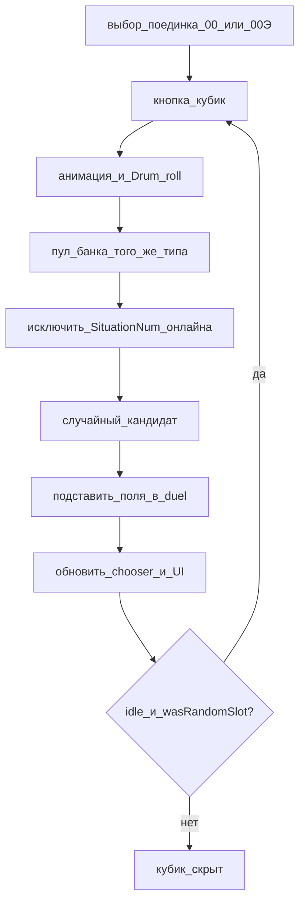

# План 2 — Случайный поединок (слот 00 / 00Э)

**Статус: выполнен (2026-08-04), сдан в архив.**

Независимый план по **резолву случайной ситуации** в уже выбранном поединке. Не включает загрузку из Google и live-запись в таблицу (см. план 3).

## Цель

Для поединков со слотом «Случайная ситуация…» (`SituationNum` = `00` / `00Э`) дать оператору кнопку-кубик: анимация + звук → подставить реальную ситуацию из банка того же типа, которой ещё нет в текущем онлайне; до старта раунда можно перебросить.

## Решение (зафиксировано)

### Поток

1. Пользователь выбирает в выпадашке поединок со слотом `00` / `00Э` («Случайная ситуация…»).
2. Рядом с кнопкой названия ситуации (`#players-name`) — **кнопка-кубик** (не путать с центральным жребием хода).
3. Клик: анимация вращения + `Drum_roll.mp3` (если звук не выключен).
4. Из банка — случайная ситуация того же типа (`00` → Классика, `00Э` → Экспресс), ещё не занятая в `duelsList`.
5. Подстановка полей в duel + обновление UI; слот получает обычный номер.
6. До старта раунда — переброс (`wasRandomSlot`, `sessionPhase === "idle"`, поединок не past).

### Переброс

- Исключаются номера **других** поединков онлайна; текущий слот снова свободен (номер может выпасть снова).

## Что сделано

- [`index.html`](../../index.html) — кнопка-кубик
- CSS — видимость и анимация
- [`js/schedule.js`](../../js/schedule.js) (и соседние) — пул, `wasRandomSlot`, подстановка
- звук — `playDrumRoll` / mute

## Вне скоупа (остаётся в других планах)

- Live-запись номера ситуации в Google после резолва — [план 3](live_протокол_google.plan.md)
- Hidden / секретная ситуация (blur)
