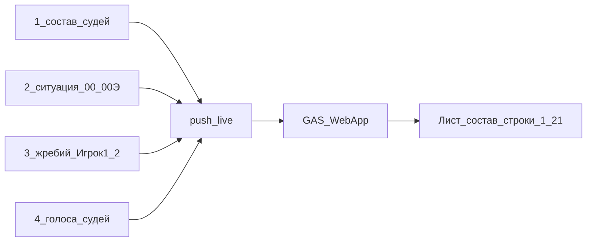

# План 3 — Live-протокол в Google

Независимый план по **записи в Google**. UI кубика ситуации — [план 2, выполнен](../Архив/случайный_поединок.plan.md); импорт расписания — [план 1, выполнен](../Архив/расписание_из_google.plan.md).

## Цель

В реальном времени обновлять сетку «состав онлайна» в Google при ключевых событиях онлайна — без ручного Excel / batch-импорта.

## Четыре события (обязательные триггеры)

Live-обновление протокола в Google срабатывает **только** по этим событиям:

| # | Событие | Что писать в сетку (1–21) | Где в таймере (ориентир) |
|---|---------|---------------------------|---------------------------|
| 1 | **Изменение состава судей** | ФИО в строках судей 1…9 колонки поединка | правки `duelAssignments` (ручное / автоназначение / ПКМ-замена) в [`js/schedule.js`](../../js/schedule.js) |
| 2 | **Выбор ситуации при случайной ситуации** (план 2) | ячейка **«Ситуация»** (после резолва/переброса `00`/`00Э` → реальный номер) | хук после резолва кубика ситуации (план 2) |
| 3 | **Результат жребия: кто Игрок 1 и Игрок 2** | строки участников/ролей сторон после жребия хода | `dice()` / фиксация сторон в [`js/core.js`](../../js/core.js) (не путать с кубиком ситуации плана 2) |
| 4 | **Результат голосования судей** | голоса судей 1…9 (+ итог/победитель, если есть в сетке) | `refereeVote` [`js/referees.js`](../../js/referees.js), `finishDuelAndClose` [`js/toolbar-sound.js`](../../js/toolbar-sound.js) |

Каждый пуш — upsert по **встрече + колонке поединка** (и при необходимости только изменённые строки события).

### Уточнения по событиям

1. **Состав судей** — любое изменение судейских слотов текущего/будущего поединка (включая автоназначение пачкой: один или несколько upsert’ов по затронутым колонкам). Игроки/секунданты из расписания при загрузке уже в сетке; live здесь про **судей**, если не решим иначе при маппинге.
2. **Случайная ситуация** — UI и пул банка в плане 2; **запись в Google — этот план**. Без пуша сетка останется на `00`/`00Э`.
3. **Жребий сторон** — центральный жребий «кто Игрок 1 / Игрок 2» (музыка интро и т.п.), не кубик ситуации. В Google уходит актуальная привязка сторон после жребия.
4. **Голосование** — запись голосов в строки «голоса судей»; при завершении поединка — финальный снимок (и победитель/итог, если такая строка есть в сетке). Частота внутри события 4 (каждый клик vs debounce vs только finish) — уточнить при маппинге; событие само по себе обязательное.

## Куда писать

**Тот же диапазон**, что сетка состава онлайна — не отдельный «лист протоколов» и не блок рейтинга A–F с 35-й строки.

Published:

`https://docs.google.com/spreadsheets/d/e/2PACX-1vQdj_LL6itPtL1m5TaoMigxcC3yZSwSa4RRG4Tk1_ro-xblfD1NtmxeuyWbo4mO1OLMvrc54g8s-ZO-/pubhtml?gid=1172864695&single=true`

| Зона | Назначение | Live |
|------|------------|------|
| **Строки 1–21, рост вправо** | встреча → ситуация → игроки/секунданты → судьи → голоса → видео | **сюда** |
| **С 35-й, A–F** | рейтинг/формулы | не пишем напрямую |

Индекс «встреча → колонки» общий с планом 1 (чтение).

## Сейчас

- Состав и `JudgeVotes` в браузере; Excel + localStorage — [`js/protocol.js`](../../js/protocol.js).
- В Google — офлайн `protocols-batch` → «протоколы игр»: [`import-protocols.gs`](../../scripts/google-apps-script/import-protocols.gs).
- Live-моста в сетку `gid=1172864695` нет.

## Подход

GAS Web App `doPost` (live upsert) → ячейки строк **1–21** по событию.

Клиент: тонкий модуль `push_live` + четыре группы хуков по таблице выше. URL/ключ — UI или localStorage, не в git.

Batch в «протоколы игр» остаётся офлайн-контуром.

## Что менять

- клиентский модуль пуша
- хуки под события 1–4 (schedule / план 2 resolve / core dice / referees + finish)
- GAS endpoint + деплой
- общий индекс встреч (кэш плана 1)

## Вне скоупа

- Импорт/сборка расписания (план 1)
- UI кубика / пул банка / анимация `00`/`00Э` (план 2) — кроме вызова live-хука после резолва
- Прямая запись в A–F с 35-й строки
- План 4 (судьи эксперты)

## Уточнить перед реализацией

1. Маппинг: какие именно строки сетки = ситуация, игроки после жребия, судьи 1…9, голоса, победитель?
2. Идентификация колонки: имя встречи + номер поединка внутри встречи, или глобальный индекс колонки?
3. Событие 4: пуш на **каждый** голос, debounce, или только при «Завершить поединок» (плюс финальный снимок)?
