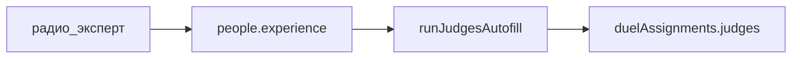

# План 4 — Судьи эксперты

Независимый план. Не включает загрузку из Google, случайный поединок и live-протокол.

## Цель

В форме **«Участники и судьи»** → вкладка **«Участники»** → колонка **«Особенности назначения»** добавить вариант для **судей-экспертов** (как отдельную пометку участника) и учесть её в автоназначении / ручных приоритетах.

## Сейчас

В [`js/schedule.js`](../../js/schedule.js) у `people[id].experience` четыре значения UI:

| # | value | Подпись |
|---|-------|---------|
| 1 | `none` | — |
| 2 | `novice` | новичок |
| 3 | `experienced` | опытный |
| 4 | `org` | орг |

«Орг» в автоназначении — только запасной проход на пустые слоты. Отдельной пометки «эксперт» нет.

Форма голосования и коллегии (hiring / negotiators / owners) от этой пометки напрямую не зависят — влияет раскладка через autofill.

## Подход (черновик до уточнений)

1. Добавить значение `experience: "expert"` (подпись **«эксперт»**) в радиогруппы вкладки «Участники».
2. Сохранение/восстановление в `localStorage` / статусе онлайна — как у остальных пометок (`protocol.js` / сериализация people).
3. Встроить в [`runJudgesAutofill`](../../js/schedule.js) и связанные ранжирования (`expRank`, фильтры `org`, замены по ПКМ) — **конкретные правила после уточнения**.
4. README: описать пометку и поведение в автоназначении.

## Вне скоупа

- План 2 (случайный поединок)
- План 3 (live-протокол Google)
- Новые коллегии на форме голосования (если не потребуется отдельно)

## Уточнить перед реализацией

1. **Место в списке:** «эксперт» как **новый 5-й** вариант (—, новичок, опытный, орг, эксперт) или **вместо «орг»**, или **4-й по смыслу** (—, новичок, опытный, эксперт) а «орг» остаётся пятым?
2. **Куда ставить экспертов при автоназначении?** (например только «Доверяющие» / любые коллегии / не в «Нанимающиеся» / приоритет над опытными)
3. **Лимиты:** сколько судейств за онлайн; можно ли назначать в тот же поединок где играют их «подопечные» — или те же инварианты, что у всех?
4. **Орг vs эксперт:** эксперт тоже только в хвост autofill, или наоборот — в первую очередь на ключевые слоты?
