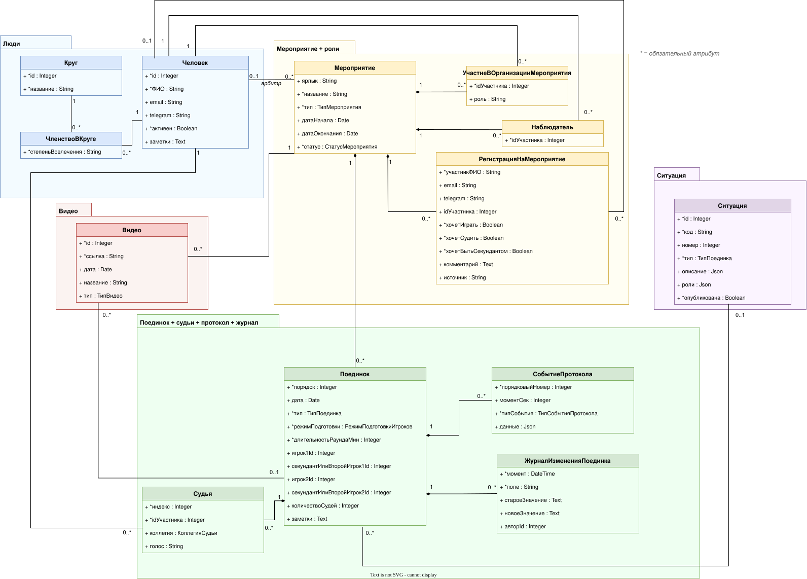

# Доменная модель ub-timer

Документ для согласования **операционного контура** (мероприятие → поединок → протокол) и правил целостности. Не дублирует внедрение, PHP и этапы портала — они в [плане 05](05_схема_БД_и_портал.plan.md).

После реализации плана 05 — перенести в корневой README.

| Артефакт | Роль |
|----------|------|
| [`05_схема_БД.drawio`](05_схема_БД.drawio) (+ [SVG](05_схема_БД.svg)) | **Канон визуала** (раскладка, пакеты, связи) |
| Этот файл | Человекочитаемая сводка: классы, справочники, решения, инварианты |
| [`05_доменная_модель.yaml`](05_доменная_модель.yaml) | Машиночитаемый слепок той же модели для ИИ |

Источники (ничего не выдумано): `.drawio` / SVG, YAML, план 05, корневой [`README.md`](../../README.md), хвост `History.log` про домен.

Уровень правила: **канон** — явно написано в README / плане 05 / `.drawio` / YAML. **К подтверждению** — логично из модели, но нигде не зафиксировано как правило.

---

## 1. Схема

Редактируемый оригинал: [`05_схема_БД.drawio`](05_схема_БД.drawio).

---

## 2. Классы и атрибуты

Обязательность — префикс `*` на диаграмме (`.drawio` / YAML). Суррогатный `id` на UML есть не у всех классов (у **Мероприятие**, **Поединок**, **Судья** и др. его нет); в черновике маппинга MySQL ключи добавляются — это маппинг, не доменный атрибут.

### Круг

Именованное сообщество / контур вовлечённости (напр. «Я-ИТ_ы», «ФУБ»).

| Атрибут | * | Тип | Пояснение |
|---------|---|-----|-----------|
| id | * | Integer | ключ |
| название | * | String | «Я-ИТ_ы», «ФУБ», … |

### ЧленствоВКруге

Связь человек — круг. У записи ровно один человек и один круг. Человек может быть в нуле или многих кругах; в круге — много членов. Две записи допустимы (в т.ч. один человек в одном круге дважды); **нет** UNIQUE(человек, круг). Вовлечённость **не** флаги на `Человек`.

| Атрибут | * | Тип | Пояснение |
|---------|---|-----|-----------|
| степеньВовлечения | * | String | роль/ступень в круге; **не** закрытый enum на диаграмме; **не** ярлык «новичок / опытный / орг / судья ФУБ» |

Примеры значений (не справочник-enum): круг **Я-ИТ_ы** — `ЧС_A1`, `ЧС_B2`, …; круг **ФУБ** — `Функционер ФУБ`, `Профессиональный судья`, `Профессиональный арбитр`, …

### Человек

Справочник людей. Без телефона. Ярлыки «новичок / опытный / орг / судья ФУБ» **не хранятся**: это **вычислимый** атрибут по кругам и статистике (рейтинг и история игр), не колонка БД и не флаги на `Человек`. `ЧленствоВКруге.степеньВовлечения` — другое поле (ступень в круге), не этот ярлык. В текущем таймере пометки живут в UI «Особенности назначения» (см. §6).

| Атрибут | * | Тип | Пояснение |
|---------|---|-----|-----------|
| id | * | Integer | ключ |
| ФИО | * | String | канон «Фамилия Имя»; жёсткой уникальности нет (коллизию решать вручную) |
| email | | String | |
| telegram | | String | @username или id |
| активен | * | Boolean | неактивные не участвуют в автоназначении |
| заметки | | Text | |

### Мероприятие

Онлайн, Купала, НГ, региональный офлайн, турнир. Арбитр — **только связь** с `Человек`, не атрибуты класса. Без `краткиеИтоги` / `заметки`. Видимость на портале выводится из статуса (не отдельное поле).

| Атрибут | * | Тип | Пояснение |
|---------|---|-----|-----------|
| ярлык | | String | опциональный URL-slug портала, не название (примеры: `kupala_26`, `online_27`); без ярлыка ссылка по id; **UNIQUE** среди заданных |
| название | * | String | «Онлайн №26», «Купала 2026» |
| тип | * | ТипМероприятия | см. §3 |
| датаНачала | | Date | |
| датаОкончания | | Date | |
| времяНачала | | Time | МСК; у онлайна с датой по умолчанию 11:00 |
| времяОкончания | | Time | МСК; у онлайна с датой по умолчанию 13:30 |
| статус | * | СтатусМероприятия | см. §3 |
| ссылкаZoom | | String | полный Zoom у онлайна; на портале и в ICS — только короткий редирект `/z/{id}` |

### УчастиеВОрганизацииМероприятия

Участие человека в организации мероприятия (не заявки): человек + мероприятие + одна роль. ФИО только из `Человек`. У одного человека на одном мероприятии **может быть несколько ролей** — несколько записей `УчастиеВОрганизацииМероприятия` (не массив в одном поле). Одна и та же роль у одного человека на одном мероприятии не дважды: **UNIQUE(мероприятие, человек, роль)**.

| Атрибут | * | Тип | Пояснение |
|---------|---|-----|-----------|
| idУчастника | * | Integer | → Человек |
| роль | * | РольОрганизатора | закрытый список, см. §3 |

### Наблюдатель

| Атрибут | * | Тип | Пояснение |
|---------|---|-----|-----------|
| idУчастника | * | Integer | → Человек |

### РегистрацияНаМероприятие

Заявки «хочу играть / судить / быть секундантом». Не смешивать с оргами и наблюдателями. Карточка `Человек` необязательна (`idУчастника` 0..1). В рамках мероприятия заявка уникальна по идентификатору заявителя: если email задан — нельзя две с тем же email; если email пуст — нельзя две с тем же ФИО. Глобального UNIQUE по ФИО на все мероприятия нет. Повторная регистрация: «Вы уже зарегистрированы».

| Атрибут | * | Тип | Пояснение |
|---------|---|-----|-----------|
| участникФИО | * | String | как в форме |
| email | | String | |
| telegram | | String | |
| idУчастника | | Integer | 0..1 → Человек |
| хочетИграть | * | Boolean | |
| хочетСудить | * | Boolean | |
| хочетБытьСекундантом | * | Boolean | |
| комментарий | | Text | |
| источник | | String | form / import / manual (маппинг) |

### Ситуация

Банк ситуаций. Подпись **не хранится**: как в Google, это конкатенация `код` + `номер`. Текст описания и ролей для UI — из JSON.

| Атрибут | * | Тип | Пояснение |
|---------|---|-----|-----------|
| id | * | Integer | ключ |
| код | * | String | напр. `110`; не UNIQUE (ситуация может повторяться в банке) |
| номер | | Integer | числовой номер из кода |
| тип | * | ТипПоединка | тот же справочник, что у `Поединок.тип`; см. §3 |
| описание | | Json | структура описания |
| роли | | Json | структура ролей (форма зависит от типа — §5) |
| опубликована | * | Boolean | |

### Поединок

Актуальный состав — поля `*Id` (без ФИО и без пар план/факт). Слоты `секундантИлиВторойИгрокNId` — одни поля: классика — секунданты, парный — 2-й игрок стороны, экспресс — строго NULL. Ситуация — ассоциацией, не `idСитуации`. Жеребьёвка «кто начинал» — не поле: после жребия расставляются `игрок1`/`игрок2` (и слоты секундант/2-й игрок); факт жребия — событие протокола. Видео на классе нет.

| Атрибут | * | Тип | Пояснение |
|---------|---|-----|-----------|
| порядок | * | Integer | порядок в мероприятии / онлайне; UNIQUE по сути `(мероприятие, дата, порядок)`, не глобально `(мероприятие, порядок)` |
| дата | | Date | для однодневных можно null |
| тип | * | ТипПоединка | классика / экспресс / парный |
| режимПодготовки | * | РежимПодготовкиИгроков | см. §3 |
| длительностьРаундаМин | * | Integer | ∈ {5, 4, 1} (`DuelMinutesLength`); зависит от `тип` — см. `round-minutes-5-4-1` |
| игрок1Id | | Integer | актуальный игрок 1 → Человек |
| секундантИлиВторойИгрок1Id | | Integer | классика: секундант 1; парный: 2-й игрок стороны 1; экспресс: строго NULL |
| игрок2Id | | Integer | актуальный игрок 2 |
| секундантИлиВторойИгрок2Id | | Integer | классика: секундант 2; парный: 2-й игрок стороны 2; экспресс: строго NULL |
| количествоСудей | | Integer | = COUNT(`Судья`) у этого поединка (сколько назначено). Не вместимость формы (экспресс 5 слотов; классика/парный 5/7/9) |
| заметки | | Text | внешняя подпись ситуации, если нет карточки в банке (турнир) |

Состав `*Id` и `авторId` журнала на диаграмме **без линий** к `Человек` (чтобы не зашумлять); смысл ссылок — в плане 05.

### Судья

Актуальный список у поединка. Пустой слот формы **не** запись `Судья`. Живой судья обязан иметь `idУчастника`. Голос `1`/`2` без ФИО — запись **без** человека (`idУчастника` null, коллегия `неизвестна`); служебной карточки в справочнике людей нет. Число записей **строго равно** `Поединок.количествоСудей` (см. `qty-matches-slots`). Вместимость формы (кнопки/слоты) — отдельно: экспресс всегда 5, классика/парный 5/7/9 (`express-judges-5`, `referee-qty-5-7-9`); это не поле индекса на судье. Поля `Судья.индекс` **нет**.

| Атрибут | * | Тип | Пояснение |
|---------|---|-----|-----------|
| idУчастника | | Integer | → Человек; null только при коллегия=`неизвестна` |
| коллегия | | КоллегияСудьи | нанимающиесяНаРаботу / отправляющиеНаПереговоры / доверяющиеСобственность / неизвестна |
| голос | | String | за кого (опционально; не закрытый справочник) |

### СобытиеПротокола

Упорядоченный лог поединка. Отдельного `ПротоколПоединка` / класса `Раунд` нет. Сессия таймера ≈ эти события (источник истины хода боя).

| Атрибут | * | Тип | Пояснение |
|---------|---|-----|-----------|
| порядковыйНомер | * | Integer | опциональный/удобный счётчик; не UNIQUE; порядок и идентичность — по `момент` |
| моментСек | | Integer | секунды от старта |
| типСобытия | * | ТипСобытияПротокола | см. §3 |
| данные | | Json | payload по типу |

### ЖурналИзмененияПоединка

История смены полей состава, судей, ситуации и т.п. (бывший план/факт — сюда, не парными колонками).

| Атрибут | * | Тип | Пояснение |
|---------|---|-----|-----------|
| момент | * | DateTime | |
| поле | * | String | что изменили |
| староеЗначение | | Text | |
| новоеЗначение | | Text | |
| авторId | | Integer | опц. → Человек |

### Видео

День целиком, клип поединка или разбор ситуации. День и клип — к мероприятию. `Разбор` — всегда к ситуации; мероприятие и поединок необязательны (если заданы — это ещё разбор этого боя). Без статуса обработки.

| Атрибут | * | Тип | Пояснение |
|---------|---|-----|-----------|
| id | * | Integer | ключ |
| ссылка | * | String | URL |
| дата | | Date | день записи / дня мероприятия (желательна) |
| название | | String | подпись |
| тип | | ТипВидео | ДеньЦеликом \| Поединок \| Разбор |

---

## 3. Справочники / перечисления

Только то, что уже есть в модели (план 05, таблица «Перечисления типов»). `степеньВовлечения` — строка, не enum. `УчастиеВОрганизацииМероприятия.роль` — enum `РольОрганизатора`. `ИсточникИтога` в доменных классах **нет** (был у убранного снимка результата) — см. §6.

### ТипМероприятия

| Значение |
|----------|
| онлайн |
| купала |
| новогоднее |
| региональный |
| турнир |

`региональный` — офлайн в городе (не Купала/НГ), в т.ч. мини-офлайн (Полярный экспресс). `турнир` — отдельный формат (УБ Лидер); размер не отдельный enum.

### СтатусМероприятия

| Значение |
|----------|
| Запланировано |
| Подготовка |
| Проведено |
| Отменено |

### ТипПоединка

Общий справочник формата: и `Ситуация.тип`, и `Поединок.тип`. Бывший enum `ТипСитуации` удалён (это не два справочника).

| Значение |
|----------|
| классика |
| экспресс |
| парный |

### РежимПодготовкиИгроков

Атрибут `режимПодготовки` на `Поединок` (вместо бывшего флага `скрытьНазваниеСитуации`).

| Значение | Смысл |
|----------|--------|
| обычный | ситуация и подпись известны заранее |
| скрытыйДоНачала | Организаторы определяют ситуацию заранее, но игроки и другие участники о ней не знают (сюрприз). Раскрытие — к началу поединка / по правилам таймера (событие `раскрытиеСитуации`). Не путать со `случайный`. |
| случайный | ситуация заранее не выбрана, выбирается розыгрышем |

`скрытыйДоНачала` и `случайный` — **разные значения** enum `РежимПодготовкиИгроков` (разные поля/значения справочника, не взаимоисключающий костыль). `случайный` — ситуация ещё не выбрана (розыгрыш из банка обычных `Ситуация`); `скрытыйДоНачала` — ситуация уже выбрана оргами, для игроков сюрприз.

### КоллегияСудьи

| Значение | Подпись |
|----------|---------|
| нанимающиесяНаРаботу | Нанимающиеся на работу |
| отправляющиеНаПереговоры | Отправляющие на переговоры |
| доверяющиеСобственность | Доверяющие собственность |
| неизвестна | Коллегия неизвестна: голос в протоколе без ФИО судьи (УБ Лидер и т.п.). Не слот формы таймера. |

### ТипСобытияПротокола

| Значение | Заметка |
|----------|---------|
| стартРаунда | |
| конецРаунда | |
| сменаХода | |
| пауза | |
| протест | |
| голос | |
| выборРоли | |
| жеребьёвка | после жребия актуальные игрок1/игрок2 расставляются на `Поединок` |
| расчетСитуации | «расчет ситуации»: какая ситуация выпала при режиме `случайный`; не путать со `скрытыйДоНачала` (там ситуация уже известна организаторам) |
| раскрытиеСитуации | режим `скрытыйДоНачала` |
| завершение | |

### РольОрганизатора

Дополнено 2026-08-13 (шаг 2): `экспертныйКомментарий`, `организацияПомещения`, `подготовкаМатериалов`, `подведениеИтогов`, `обновлениеДанных`, `обработкаВидео`. Значения на диаграмме `.drawio` не перечисляются (там только тип `РольОрганизатора`).

| Значение | Смысл |
|----------|--------|
| планированиеМероприятия | Планирование мероприятия |
| подготовкаУчастников | Подготовка участников |
| работаСНовичками | Работа с новичками |
| показывалЧасы | Показывал часы |
| велЗапись | Вел запись |
| настраивалКомнатыZoom | Настраивал комнаты Zoom |
| экспертныйКомментарий | Экспертный комментарий |
| организацияПомещения | Организация помещения |
| подготовкаМатериалов | Подготовка материалов |
| подведениеИтогов | Подведение итогов |
| обновлениеДанных | Обновление данных |
| обработкаВидео | Обработка видео |

### ТипВидео

| Значение | Связь с поединком |
|----------|-------------------|
| ДеньЦеликом | только мероприятие (`Поединок` null) |
| Поединок | поединок **обязан** быть |
| Разбор | только ситуация; мероприятие и поединок null. Источник: лист «Ситуации», колонка «Разбор ситуации» |

---

## 4. Решения (почему так)

Зафиксировано в плане 05 (и согласовано с `.drawio` / YAML):

- **Нет материалов** — методички закрепа TG не в модели (статичные ссылки на портале).
- **Нет начислений / рейтинга как сущностей** — баллы только отчёт/VIEW; класса `НачислениеБаллов` нет.
- **Нет результата как сущности** — победитель и счёт не атрибуты `Поединок` и не класс; вычисление по `Судья.голос` (при необходимости — по событиям протокола). Live в Google тоже **не пишет** победителя и счёт (формулы таблицы).
- **Арбитр = связь**, не роль-наследник и не `арбитрId`/`арбитрФИО` на классе.
- **Ситуация без названия** — подпись вычислимая (`код`+`номер`); «дыры» названия в модели нет.
- **Видео отдельно** — не поля на `Поединок`; день/клип — к мероприятию; `Разбор` — к ситуации без мероприятия; без `статусВидео`.
- **Журнал изменений поединка** — актуальный состав на `Поединок`; история (в т.ч. бывший план/факт) в журнале. Иерархий `УчастиеВПоединке` / `ИгрокКоманды` / `Секундант` нет.
- **Секундант / 2-й игрок — одни поля** — слоты `секундантИлиВторойИгрок1Id` / `секундантИлиВторойИгрок2Id` (не отдельные атрибуты). Классика — секунданты; парный — вторые игроки сторон (секундантов нет); экспресс — оба строго NULL.
- **Сессия таймера ≈ события протокола** — не сущность `timer_sessions` как главный путь. Runtime (фаза, смена хода, пауза, протест, жеребьёвка, раскрытие…) пишется как `СобытиеПротокола`; голоса — на `Судья`; состав/длительность — на `Поединок`. Снимок UI/часов можно кэшировать — это не источник истины.
- **«Команда 1/2»** — артефакт Google-сетки, в домене нет (`команда`, `started_by_team`, слоты team1/team2). После жребия UI может поменять местами игроков; в Google стороны остаются Команда 1/2.
- **Жеребьёвка** — отдельного поля «кто начинал» нет; результат — расстановка `игрок1`/`игрок2` + событие `жеребьёвка`.
- **УчастиеВОрганизацииМероприятия и Наблюдатель** — отдельные сущности, без общего абстрактного «УчастиеВМероприятии».
- **Регистрация** — заявки, не орги/наблюдатели.
- **Человек** — без телефона и без хранимых флагов опыта/орга; вовлечённость через **Круг** / **ЧленствоВКруге**. Ярлыки «новичок / опытный / орг / судья ФУБ» — **вычислимые** (круги + статистика: рейтинг и история игр), не колонка БД; `степеньВовлечения` — не этот ярлык.
- **Класс Раунд не используем** — произвольное число раундов (README) живёт событиями протокола (`стартРаунда` / `конецРаунда` и т.д.).
- **Протокол** — только `СобытиеПротокола` у поединка; контейнера `ПротоколПоединка` нет.
- **УчастиеВОрганизацииМероприятия.роль** — закрытый enum `РольОрганизатора` (обязательна). Несколько ролей на одном мероприятии — несколько записей, не массив. Состав судей и протокол **не** роли этого enum.
- **Состав судей считает алгоритм**, не ручная роль орга. Записи `Судья` — результат алгоритма (не судить свой поединок, неактивных не автоназначать, экспресс — только «Отправляющие на переговоры», слоты формы 5/7/9). Не роль `назначалСудей`.
- **Протокол пишет таймер** (`СобытиеПротокола`); это не роль `УчастиеВОрганизацииМероприятия` и не `велПротоколы`. `показывалЧасы` — учёт оператора кнопок.
- **Судья без индекса** — вместимость формы 5/7/9 (тип/UI); запись `Судья` — только назначенный человек; `количествоСудей` = COUNT записей.
- **Один тип формата** — `ТипСитуации` слит с `ТипПоединка`; ситуация и поединок ссылаются на один enum. У `ТипМероприятия` нет значения «другое».

---

## 5. Правила целостности / инварианты

### Канон

Явно в корневом README, плане 05, `.drawio` или YAML.

| id | Правило |
|----|---------|
| **express-judges-5** | У **экспресса всегда 5 судейских слотов формы** (вместимость / `RefereeQty` = 5, правило типа). Это **слоты формы**, не «всегда 5 записей `Судья`» и не обязательно `количествоСудей` = 5: число кнопок на форме = 5, включая пустые («Судья N»). Пустой слот **не** запись `Судья`. Голос без ФИО — запись без `idУчастника` (`unknown-judge-placeholder`). Сколько назначено — `qty-matches-slots`. Источник: README («Экспресс всегда **5** судей»; «число кнопок = RefereeQty, не число назначенных фамилий») + ответ по домену 2026-08-13. |
| **qty-matches-slots** | Число записей `Судья` у поединка **строго равно** `Поединок.количествоСудей` (`COUNT` = поле). Пустой слот формы не запись. У экспресса назначено 0..5; вместимость формы при этом всегда 5 (`express-judges-5`). У классики/парного вместимость формы 5/7/9 (`referee-qty-5-7-9`) — **не** требование заполнить все слоты. **Стык:** слоты формы ≠ число записей / `количествоСудей`. Источник: ответ по домену 2026-08-13. |
| **express-only-sending** | У экспресса на форме голосования видна только коллегия **«Отправляющие на переговоры»** (5 кнопок по центру); «Нанимающиеся на работу» и «Доверяющие собственность» скрыты. В таблице «Расписание» для колонки экспресса активны пять «Отправляющие на переговоры 1…5»; «Нанимающиеся на работу»/«Доверяющие собственность» серые. Источник: README. |
| **express-no-seconds** | У экспресса **нет секундантов и нет вторых игроков**: в UI только строки «Игрок»; отображение имени — только игрок (не `Игрок (Секундант)`). На `Поединок` оба поля `секундантИлиВторойИгрок1Id` / `секундантИлиВторойИгрок2Id` **строго NULL**. Источник: README + ответ по домену 2026-08-13. |
| **second-or-player2-by-type** | Одни слоты `секундантИлиВторойИгрок1Id` / `секундантИлиВторойИгрок2Id` (не новые поля). **Классика:** это секунданты (опционально). **Парный:** секундантов нет; поля = вторые игроки сторон; состав стороны = `игрокN` + `секундантИлиВторойИгрокN`. **Экспресс:** оба строго NULL (см. `express-no-seconds`). Источник: ответ по домену 2026-08-13. |
| **referee-qty-5-7-9** | Допустимая **вместимость формы** (число слотов/кнопок): **5, 7 или 9**. Классика и парный — любое из трёх (меню «5/7/9 судей»). Экспресс — всегда 5 (`express-judges-5`). Это не `количествоСудей` в БД и не требование полного ряда записей `Судья` (см. `qty-matches-slots`). При загрузке/runtime таймер **нормализует** к ближайшему из {5, 7, 9}, при равной дистанции — **вверх** (6→7, 8→9, 4→5). Источник: README; черновик маппинга `referee_qty` 5/7/9. |
| **classic-pair-colleges** | Классика и парный используют **три коллегии** (Нанимающиеся на работу / Отправляющие на переговоры / Доверяющие собственность); набор судейских строк зависит от 5/7/9. Источник: README. |
| **round-minutes-5-4-1** | `длительностьРаундаМин` ∈ {5, 4, 1} (`DuelMinutesLength`). Связано с `Поединок.тип` (`ТипПоединка`): **экспресс** — всегда 1; **парный** — всегда 5; **классика** — всегда 4 или 5 (не 1). Источник: README + план 05 + ответ по домену 2026-08-13. |
| **video-always-event** | `ДеньЦеликом` и `Поединок` принадлежат мероприятию. `Разбор` — к ситуации; мероприятие и поединок необязательны (колонка J банка — без них; ogg после боя — с поединком). Источник: план 05 + решение 2026-08-19. |
| **video-type-vs-duel** | `ДеньЦеликом` ⇒ поединок **null**. `Поединок` ⇒ поединок **обязан**. `Разбор` ⇒ ситуация обязана; мероприятие и поединок необязательны. |
| **registration-optional-person** | Регистрация может быть без `Человек`: `Человек "0..1" -- "0..*" РегистрацияНаМероприятие`. Источник: `.drawio` / план 05. |
| **players-optional** | Игроки и слоты `секундантИлиВторойИгрокNId` на `Поединок` **не** помечены `*`: состав может быть неполным (черновик сетки, слот без людей). Источник: `.drawio` / таблица обязательности в плане 05. |
| **situation-optional** | У поединка ситуация 0..1; в режиме `случайный` может быть без выбранной до события `расчетСитуации`. Источник: план 05. |
| **hidden-ne-random** | `скрытыйДоНачала` и `случайный` — разные значения enum `РежимПодготовкиИгроков`. `случайный` — ситуация заранее не выбрана (розыгрыш); `скрытыйДоНачала` — уже выбрана оргами, для игроков сюрприз. Это разные поля/значения справочника, не взаимоисключающий костыль. Источник: ответ по домену 2026-08-13. |
| **cannot-judge-own-duel** | Игрок и человек в слоте `секундантИлиВторойИгрокN` (секундант в классике / 2-й игрок в парном) **не** назначаются судьями **в этом же** поединке. В одном поединке человек не занимает две роли сразу. Запись без `idУчастника` (коллегия `неизвестна`) в это не входит. Источник: README (автоназначение + ручной выбор). |
| **unknown-judge-placeholder** | Голос `1`/`2` в протоколе без ФИО → запись `Судья` **без** человека (`idУчастника` null), коллегия **`неизвестна`**. Карточки «Судья неизвестен» в справочнике людей нет. Пустой слот без голоса по-прежнему не запись. В рейтинге «судил» не начисляется; голоса игрокам считаются. Источник: ответ по домену 2026-08-13. |
| **inactive-not-assigned** | Неактивные (`Человек.активен = false`) исключаются из автоназначения. Источник: README. |
| **judges-by-algorithm** | Состав судей **считает алгоритм**, не роль орга. Записи `Судья` — результат (`cannot-judge-own-duel`, `inactive-not-assigned`, `express-only-sending`, вместимость 5/7/9). Не роль `назначалСудей`. Источник: README (автоназначение) + ответ по домену 2026-08-15. |
| **situation-roles-json-by-type** | `Ситуация.роли`: для **классики и парного** — массив `{Role, Goals}`; для **экспресса** — два объекта `{Role, Phrase}` (Phrase у первой роли; в карточке банка блок ролей для экспресса скрыт, на экране боя — агрессивная фраза). Источник: README. |
| **situation-label-computed** | Название/подпись ситуации не хранится: конкатенация `код` + `номер`. Источник: план 05. |
| **arbitrator-optional** | Арбитр на мероприятии необязателен (`Человек "0..1" -- "0..*" Мероприятие : арбитр`). Источник: `.drawio`. |
| **org-observer-require-person** | УчастиеВОрганизацииМероприятия и Наблюдатель всегда указывают на человека (`Человек "1"`). Источник: `.drawio`. |
| **votes-on-judge** | Голос хранится на `Судья`, не на поединке и не отдельным результатом. Источник: план 05. |
| **protocol-is-event-log** | Ход боя (в т.ч. сессия таймера) — `СобытиеПротокола`; отдельной обязательной сущности сессии нет. **Не** роль `УчастиеВОрганизацииМероприятия` и не `велПротоколы`. `показывалЧасы` — оператор кнопок, протокол пишет таймер. Источник: план 05 + ответ по домену 2026-08-15. |
| **involvement-label-computed** | Ярлыки «новичок / опытный / орг / судья ФУБ» **вычислимы** по кругам и статистике (рейтинг и история игр); **не хранятся**. `ЧленствоВКруге.степеньВовлечения` — другое поле. Источник: ответ по домену 2026-08-13. |
| **organizer-role-enum** | `УчастиеВОрганизацииМероприятия.роль` обязательна, закрытый список `РольОрганизатора`. Несколько ролей у человека на мероприятии — несколько записей `УчастиеВОрганизацииМероприятия`. Источник: ответ по домену 2026-08-13. |
| **no-judge-index** | У `Судья` нет поля индекса. Вместимость формы 5/7/9 — правило типа/UI (`express-judges-5`, `referee-qty-5-7-9`); `Поединок.количествоСудей` = COUNT записей (см. `qty-matches-slots`). Источник: ответ по домену 2026-08-13. |
| **membership-person-circle-not-unique** | Две записи `ЧленствоВКруге` допустимы (в т.ч. один человек в одном круге дважды). **Нет** UNIQUE(человек, круг). Источник: ответ по домену 2026-08-13. |
| **duel-unique-event-date-order** | В одном мероприятии не должно быть двух поединков с одним `порядок` **в одну дату**. UNIQUE по сути `(мероприятие, дата, порядок)`; не глобально `(мероприятие, порядок)` без даты (многодневное мероприятие). Источник: ответ по домену 2026-08-13. |
| **protocol-identity-by-moment** | `СобытиеПротокола.порядковыйНомер` — опциональный/удобный счётчик, не правило целостности. Порядок и идентичность — по точному времени события (`момент` / `моментСек`). **Нет** UNIQUE(поединок, порядковыйНомер). Источник: ответ по домену 2026-08-13. |
| **person-fio-not-unique** | Жёсткой уникальности ФИО нет. Полных однофамильцев пока нет — **наблюдение, не** UNIQUE(ФИО). Коллизию решать вручную, если появится. Источник: ответ по домену 2026-08-13. |
| **situation-code-not-unique** | Ситуация в теории может повторяться; **нет** UNIQUE(код). Код+номер могут совпадать у разных записей / ситуация может повторяться в банке. Источник: ответ по домену 2026-08-13. |
| **organizer-role-unique** | В одном мероприятии у одного человека одна и та же роль не дважды. **UNIQUE(мероприятие, человек, роль)**. Разные роли — разные записи. Источник: ответ по домену 2026-08-13. |
| **registration-unique-in-event** | В одном мероприятии нельзя две заявки `РегистрацияНаМероприятие` с одним email. Если email пуст — нельзя две с тем же `участникФИО`. Идентификатор заявителя: email, если задан, иначе ФИО. **Не** глобальный UNIQUE по ФИО на все мероприятия. Повторная регистрация: «Вы уже зарегистрированы». Источник: ответ по домену 2026-08-13. |
| **event-slug-unique** | `Мероприятие.ярлык` — опциональный URL-slug портала, не название (примеры: `kupala_26`, `online_27`). Без ярлыка ссылка по id. Если задан — **UNIQUE(ярлык)** среди непустых; NULL/пустое не конфликтует. Источник: ответ по домену 2026-08-13. |

Стык слоты формы vs записи: вместимость формы (экспресс всегда 5; классика/парный 5/7/9) — правило типа/UI; `количествоСудей` и число записей `Судья` равны между собой (сколько назначено) и **не** обязаны равняться вместимости.

Смешанное расписание (канон UI таймера, README): общие строки таблицы; физические слоты `j0…j8` зависят от типа колонки. У экспресса судейские слоты — `j3…j7` (пять «Отправляющие на переговоры»). В домене это **только UI**: записи `Судья` без индекса слота.

Операционные эвристики автоназначения (проходы 0–3, лимиты слотов, соседство, судья ФУБ, орги) — **канон текущего таймера** в README, но это не ограничения схемы БД. Ярлыки «новичок / опытный / судья ФУБ / орг» в домене **не колонки** (см. `involvement-label-computed`).

### К подтверждению

Сейчас пусто.

---

## 6. Что сознательно НЕ в модели

- Отчёты: рейтинг, матрица пар, баллы / `НачислениеБаллов` / `rating_points` (только запрос/VIEW).
- Снимок `РезультатПоединка` / `duel_results` и перечисление **ИсточникИтога** (таймер, бумага, google, вручную) — денормализация витрины, не доменный класс.
- Google-only: «Команда 1/2», `started_by_team`, `google_column_1based`, `google_meeting_name`, `google_name_key`, полная история кликов live в сетке.
- Sync / конфиг: `sync_runs`, `app_settings`, ключи Live-протокола.
- `materials` / файлы видео на диске (только URL).
- CRM-воронка (фаза 6 плана).
- Класс `Раунд`, контейнер `ПротоколПоединка`, `timer_sessions` как источник истины.
- Иерархия `УчастиеВПоединке` / слоты team1/team2 / поле «кто начинал».
- Флаги на `Человек`: телефон; ярлыки новичок / опытный / орг / судья ФУБ / `experience=expert` (вычислимые, не колонки; в таймере — UI-пометки).
- Статус обработки видео; видимость портала как отдельное поле (выводится из статуса мероприятия).
- Исключения «не может на этот поединок» — только сессия таймера, не сохраняются.
- Поле `Судья.индекс` (вместимость формы 5/7/9 — тип/UI; `количествоСудей` = COUNT записей).
- Логика часов парного «как у классики» и отображение стороны в таймере — канон UI (README), не инвариант схемы БД.

Внедрение, маппинг MySQL, портал и фазы: [план 05](05_схема_БД_и_портал.plan.md).
